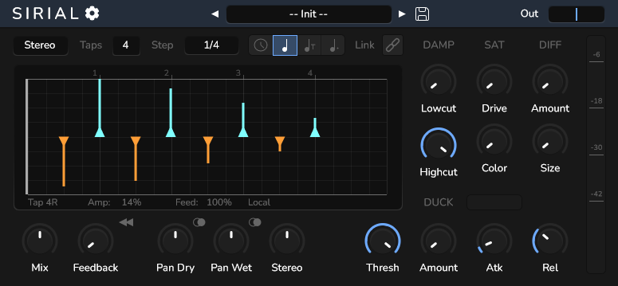

<h1 align="center">
  <!--  -->
  Sirial
  <br>
</h1>
<div align="center">

[](https://github.com/tiagolr/sirial/releases)
[](https://github.com/tiagolr/sirial/releases)
[](https://github.com/tiagolr/sirial/releases)

</div>
<div align="center">

[](https://github.com/tiagolr/sirial/releases/latest)


</div>

<div align="center">



</div>

**Sirial** is a _Rhythmic Delay_ where each tap can be placed and configured with different amplitudes and feedback giving total control on how the delay responds and the patterns it creates.

It is loosely based on EchoBoy Tap mode, with the novelty that it uses _serial delay lines_ instead of delay taps, this hybrid approach enables the versatility of multi-tap delays with the natural decay (optional) and coloring of standard delays, producing a more pleasant and realistic sound.

The main advantage of using serial delay lines is that any effects on the feedback path, like damping, are applied on each tap like normal delays, it also enables natural decay over the taps and allows for classic modes like Ping-Pong or cross feedback. This comes at a cost of complexity and CPU usage, not that the serial delay lines are expensive its just that multiple taps on a single delay line are extremely cheap.

This plug-in doesn't include many effects since applying them on each tap can be prohibitively costly, for example feedback pitch-shift or saturation would be computed each sample for 16 delay lines * 2 channels. The effects included are only pre or post delay, any pre or post FX can be added outside the plug-in in any DAW. If you are looking for a typical delay with more FXs and modes checkout [QDelay](https://github.com/tiagolr/qdelay).

## Features

  * **16 Serial Delay Lines** allows to build intricate delay patterns
  * **Intuitive UI** to configure the taps offset and amplitude
  * **Stereo Taps** with different offsets for left and right channels
  * **Ping-Pong Mode** where the feedback is crossed on each tap
  * **Delay Reverse** mode
  * **Basic Effects** like damping, saturation and diffusion
  * **Ducking** with controls for threshold, amount, attack and release

## Download

* [Download latest release](https://github.com/tiagolr/sirial/releases)
* Current builds include VST3 for Windows, VST3 and LV2 for Linux and AU and VST3 for macOS.

## Tips

* Use shift to fine tune taps position or knobs value.
* On the top-right corner of the viewport there is a small triangle that opens a menu.
* To produce decay only on the first tap, use the viewport menu or manually set each tap feedback to local and give it 100% feedback.
* There is a small button next to feedback knob that turns _reverse mode_ on.
* Panning collapses one of the channels by default but there is an alternative mode where the taps are summed onto the same channel instead.


## MacOS

Because the builds are unsigned you may have to run the following commands:

```bash
sudo xattr -dr com.apple.quarantine /path/to/your/plugins/sirial.component
sudo xattr -dr com.apple.quarantine /path/to/your/plugins/sirial.vst3
sudo xattr -dr com.apple.quarantine /path/to/your/plugins/sirial.lv2
```

The commands above will recursively remove the quarantine flag from the plug-ins.

## Build

```bash
git clone --recurse-submodules https://github.com/tiagolr/sirial.git

# windows
cmake -G "Visual Studio 17 2022" -DCMAKE_BUILD_TYPE=Release -S . -B ./build
cmake --build build

# linux
sudo apt update
sudo apt-get install libx11-dev libfreetype-dev libfontconfig1-dev libasound2-dev libxrandr-dev libxinerama-dev libxcursor-dev
cmake -G "Unix Makefiles" -DCMAKE_BUILD_TYPE=Release -S . -B ./build
cmake --build ./build --config Release

# macOS
cmake -G "Unix Makefiles" -DCMAKE_BUILD_TYPE=Release -DCMAKE_OSX_ARCHITECTURES="x86_64;arm64" -S . -B ./build
cmake --build ./build --config Release
```
